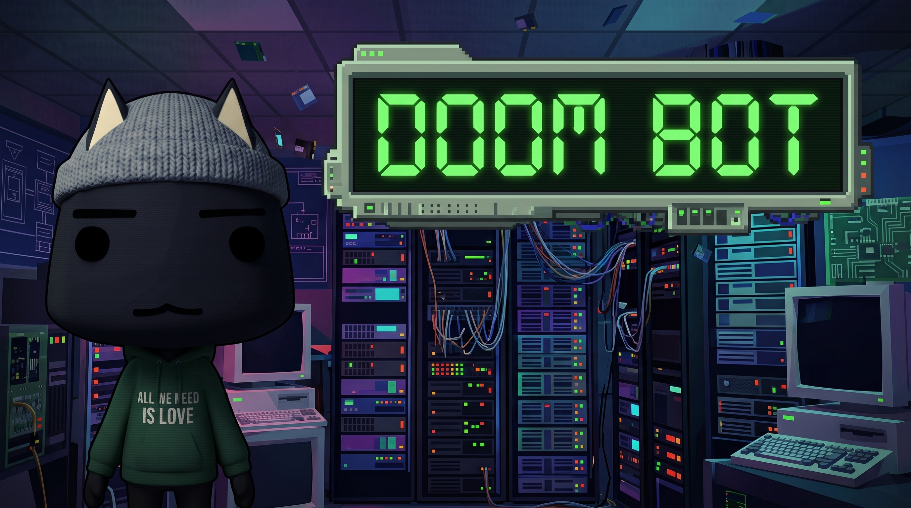

# Doom Bot

Hi, that's bot named **Doom** is a bot dedicated to resolve diferent types of customer supports among diferents platforms like:
- `Whatsapp`
- `Telegram`
- `GLPI`
- `Teams` and another platforms will be add.

The first version includ principally `Zulip`, `Teans` and `GLPI`
<!-- 
El Núcleo (Core) no conoce NADA del mundo exterior.

Este bot se encarga de guiar en el proceso de soporte técnico a los empleados que requieren de los serivicios de un departamento de TI, el bot tiene como principal objetivo ser el filtro inicial para guiar al usuario en el proceso de atención al cliente.

La versión 1.0 del bot tiene integrado 3 comandos:
- `/Ayuda`
- `/caso`
- `/glpi` -->

---

Author: *Luis A. Sarmiento Diaz*